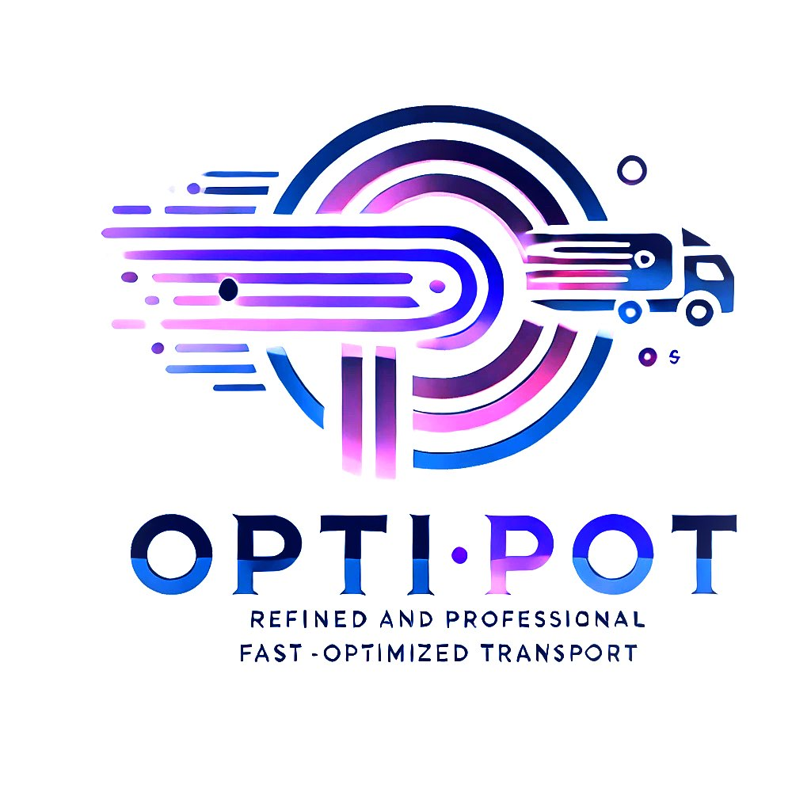

# 🚚 OptiPot - Smart Delivery Route Optimization

<p align="center">
  
</p>

<p align="center">
  <strong>🏆 Winner of AdaHack 2025 - Optimization of Delivery Routes Challenge</strong>
</p>

OptiPot is a delivery route optimization platform combining advanced algorithms with environmental consciousness. Built to tackle the complex challenges of modern urban delivery, OptiPot helps businesses reduce costs, minimize environmental impact, and improve delivery efficiency.

## Overview

OptiPot leverages Google OR-Tools and historic data processing to solve the Vehicle Routing Problem (VRP) for mixed fleet operations. Whether you're managing trucks, vans, or eco-friendly bikes, OptiPot ensures your deliveries are optimized for speed, cost, and sustainability.

## Key Features

- 🗺️ **Smart Route Optimization** - AI-powered route planning using Google OR-Tools
- 🌱 **Environmental Impact Tracking** - Real-time CO₂ emissions monitoring and reduction
- 🚛 **Mixed Fleet Management** - Support for trucks, vans, and electric bikes
- ⏰ **Time Window Compliance** - Ensures on-time deliveries with priority handling
- 📊 **Real-time Analytics** - Comprehensive dashboard with KPIs and metrics
- 🗺️ **Interactive Maps** - Visual route planning with Mapbox integration
- 💰 **Cost Optimization** - Minimize fuel costs and maximize vehicle utilization
- 📱 **Driver-Friendly Interface** - Simple, intuitive navigation for delivery personnel

## 🛠️ Tech Stack

### Backend
- **FastAPI** - High-performance Python web framework
- **Google OR-Tools** - Advanced optimization algorithms
- **SQLite** - Lightweight database for data persistence
- **Python 3.x** - Core backend language

### Frontend
- **React + TypeScript** - Type-safe component architecture
- **Vite** - Lightning-fast build tool
- **Tailwind CSS** - Utility-first styling
- **shadcn/ui** - Modern, accessible UI components
- **Mapbox GL JS** - Interactive mapping and visualization
- **React Query** - Efficient data fetching and caching

## Prerequisites

Before you begin, ensure you have:
- Python 3.8 or higher
- Node.js 16.x or higher
- npm or yarn package manager
- Git

## Installation

1. **Clone the repository**
   ```bash
   git clone https://github.com/yourusername/OptiPot.git
   cd OptiPot
   ```

2. **Set up the backend**
   ```bash
   cd backend
   pip install -r ../requirements.txt
   ```

3. **Set up the frontend**
   ```bash
   cd ../frontend
   npm install
   ```

4. **Environment configuration**
   ```bash
   # In the root directory
   cp .env.example .env
   # Edit .env with your configuration
   ```

## Running the Application

1. **Start the backend server**
   ```bash
   cd backend
   uvicorn main:app --reload
   ```
   The API will be available at `http://localhost:8000`

2. **Start the frontend development server**
   ```bash
   cd frontend
   npm run dev
   ```
   The application will be available at `http://localhost:5173`

## Usage

### For Fleet Managers
1. Access the dashboard to view real-time metrics
2. Navigate to Route Planner to optimize delivery routes
3. Apply filters for environmental or economic optimization
4. Review the generated routes on the interactive map
5. Monitor fleet performance and emissions

### For Drivers
1. Log in to view assigned routes
2. Follow the optimized delivery sequence
3. Track progress and update delivery status

## Key Optimization Features

### Multi-Objective Optimization
- **Distance Minimization** - Shortest paths between delivery points
- **Emission Reduction** - Prioritize low-emission vehicles
- **Cost Efficiency** - Balance fuel costs and time
- **Capacity Utilization** - Maximize vehicle load efficiency

### Advanced Filtering
- 🌱 Environmental filters (EV priority, low emissions)
- 💵 Economic filters (fuel efficiency, toll avoidance)
- 🚚 Vehicle specifications (capacity, fuel type)
- ⚡ Performance filters (traffic avoidance, express priority)

---

Built with ❤️ for a more sustainable future in logistics 🌍